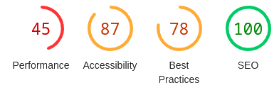
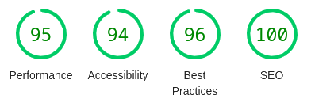

### Modifications graphiques

Réorganisation de la grille des projets pour une meilleure hiérarchisation des informations.
Ajout d'un filtre par type de projet.

### Ajout de fonctionnalités

Création d'un formulaire de contact pour faciliter la mise en relation avec des clients, sans risquer de dévoiler publiquement une adresse mail

### Optimisations techniques

Le site a entièrement été réécrit à la main et transformé en un site "statique" alimenté par un CMS gratuit appelé [Storyblok](https://www.storyblok.com/).
Les images on toutes été optimisées, sont automatiquement allégées et redimensionnées, surtout pour un affichage sur mobile.
L'hébergement a été changé pour Netlify, en restant dans leur offre gratuite

### Le résultat

Les scoresGoogle Lighthouse sont grandement améliorés, surtout en matière de performance technique :

#### Site initial :

#### Refonte optimisée:

Quant à l'impact carbone, il a été **divisées par 60 !**, faisant passer le site de la tranche des 2% les plus polluants à celle des 14% les moins émetteurs de carbone.
