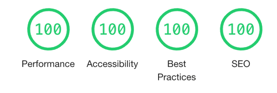

L'enjeu principal de ce site présentant mon travail de développeur web était d'illustrer mes principes de développement : personnalisation, performances et sobriété

### Personnalisation

Tout est comme à mon habitude développé "from scratch" et ligne par ligne. Il s'agissait de montrer qu'un site "statique" n'est pas forcément inerte : je me suis autorisé quelques effets d'animation, notamment sur le formulaire de contact qui glisse depuis le bord droit de l'écran.

### Performances

Grâce à un code optimisé, le site obtient de la part de Google Lighthouse un score parfait :

Par ailleurs, selon le [WebsiteCarbon Calculator](https://www.websitecarbon.com/website/nicolasseine-com/), son empreinte carbone est meilleure que celle de 96% des sites internet du monde.
